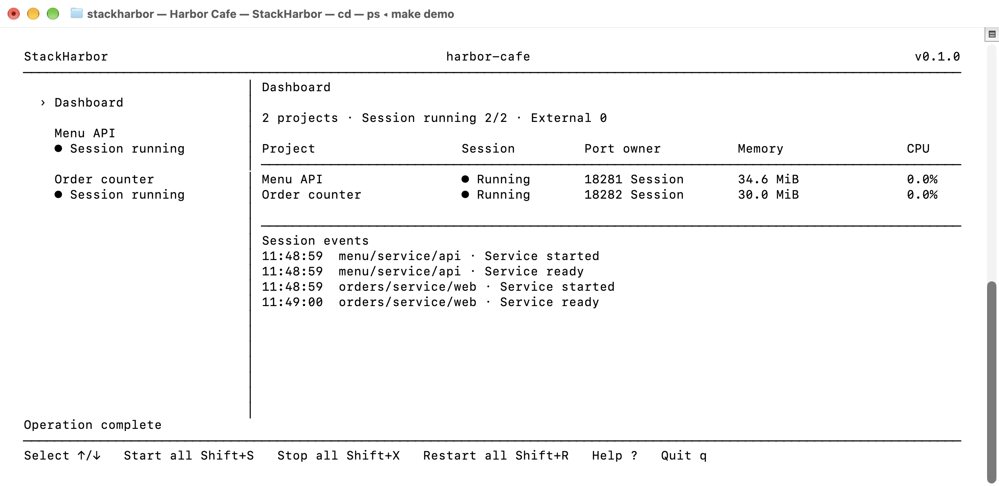
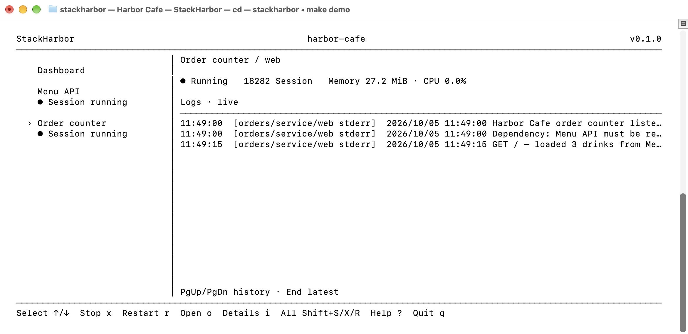

# StackHarbor

**A lightweight, local development console for humans and coding agents.**

See which services and ports are running. Start your apps without remembering their commands. Keep control of what starts and stops.

[简体中文](README.zh-CN.md) · [Releases](https://github.com/szhjia/stackharbor/releases) · [Agent skill](skills/stackharbor/SKILL.md) · [Contributing](CONTRIBUTING.md)

[](https://github.com/szhjia/stackharbor/actions/workflows/check.yml)
[](https://github.com/szhjia/stackharbor/releases/latest)
[](LICENSE)
[](https://skills.sh/szhjia/stackharbor/stackharbor)

## Development and design philosophy

AI coding tools make it easier to turn ideas into applications. Every new app also brings startup commands, ports, logs, and dependencies to manage. StackHarbor gives those growing app collections a shared place in your terminal, so you can spend less time recalling commands and finding terminal tabs.

- **Keep daily development lightweight.** Use one local terminal program and readable configuration, with no hosted control platform to set up.
- **Keep existing project workflows.** Register the foreground commands your apps already use. Preserve their languages, package managers, and startup contracts.
- **Make running state clear.** Show observed services, listening ports, port ownership, and logs. Unknown measurements stay unknown; session-owned processes and external services remain distinct.
- **Make operations explicit.** Opening the console starts nothing. Show the impact before stopping or restarting dependencies, and check process identity before releasing an external port.
- **Respect different lifecycles.** Persistent databases, one-time tasks, and long-running services have separate handling. Normal exit cleans up session-owned processes while retaining persistent resources.
- **Give humans and agents the same contract.** Versioned YAML, machine-readable discovery and validation, read-only plans, and a bundled skill make project setup inspectable and repeatable.

## Core advantages

- **See services and ports in one place.** Find out which registered apps are running, who owns their listening ports, and where to read their logs. Port declarations describe the expected listeners; observed ownership and readiness provide runtime evidence.
- **Register commands once, reuse them every day.** Save the working directory, command, ports, and dependencies in YAML. Start, stop, or restart through the console without recalling a different command for each app.
- **Bring several projects into one workspace.** Discover project registrations and view them together while preserving each project's own startup workflow. Unregistered candidates are shown for review and never executed automatically.
- **Work with your coding agent.** The bundled skill helps agents install and register apps using their real startup commands. JSON discovery, validation, and read-only dependency plans give agents a consistent way to inspect configuration before acting.
- **Run locally with clear operation boundaries.** The console runs on your machine. Starting services is explicit; external services are observed without acquiring stop permission, and dependency changes show their impact. These controls make operations predictable; commands still run with your user permissions.

## How StackHarbor differs from related tools

Choose StackHarbor when your main need is to keep a growing collection of local apps understandable: which services and ports are running, how to start each app, and which processes your session owns. Its lightweight workflow uses existing commands, project registrations, a workspace overview, and explicit lifecycle controls.

| Tool | Main focus | StackHarbor's focus by comparison |
| --- | --- | --- |
| [Process Compose](https://github.com/F1bonacc1/process-compose) | General local process orchestration, including dependencies, health checks, recovery, a TUI, REST API, and MCP integration | Project discovery, reusable registrations, service/port visibility, and explicit session control for daily development |
| [dekit (the next version of mprocs)](https://github.com/pvolok/dekit) | Process management for development and production, with dependency handling, crash recovery, background running, and a CLI for humans and agents | A foreground local console whose normal exit cleans up its owned processes and retains persistent resources |
| [Overmind](https://github.com/DarthSim/overmind) | Procfile-based process management and interactive access through tmux | YAML project registrations and a workspace overview, without requiring tmux |
| [Tilt](https://github.com/tilt-dev/tilt) | A development loop that watches code, builds container images, and updates environments using Kubernetes or Compose | Direct use of existing local foreground commands, with optional Compose resources |

StackHarbor keeps setup small: one terminal binary, no tmux requirement, and Docker only for apps that use Compose resources. Its advantage for this use case is the combination of project discovery, service/port visibility, reusable commands, and explicit session ownership. Choose according to the workflow you need; related tools also offer local operation and agent support.

## Install

### Release binary on macOS or Linux

Prebuilt releases support Apple Silicon/Intel macOS and arm64/amd64 Linux. Running the binary does not require Go. Download and inspect the installer, then install the latest stable release:

```sh
curl -fsSL https://raw.githubusercontent.com/szhjia/stackharbor/main/scripts/install-release.sh -o /tmp/stackharbor-install.sh
sh /tmp/stackharbor-install.sh
export PATH="$HOME/.local/bin:$PATH"
stackharbor --version
```

The installer selects your platform, verifies the archive against the release's SHA256 manifest, and installs to `~/.local/bin` without sudo. It refuses to overwrite an existing command. Add the PATH line to your shell configuration if needed. To choose a release and destination:

```sh
sh /tmp/stackharbor-install.sh 0.2.0 "$HOME/.local/bin"
```

You can also download an archive and `SHA256SUMS` from [Releases](https://github.com/szhjia/stackharbor/releases), verify it, extract it, and run `sh scripts/install.sh` inside the extracted directory. For upgrades, inspect the existing installation and move the old binary aside before reinstalling; keep it for rollback. Releases are not Apple-notarized.

A real terminal is required for workspace sessions; the bundled browser gateway can be launched from another terminal. Release runtime needs neither Node nor Go. `ps` is used for process trees; install `lsof` for listener ownership (unknown if unavailable). Linux uses `xdg-open` to open URLs. Managed apps still need their own runtime dependencies. Docker is optional, for Compose resources only.

### Optional coding-agent skill

Install the bundled skill through the open skills CLI (requires Node.js/npm):

```sh
npx skills add szhjia/stackharbor
```

Public skill page: [stackharbor on skills.sh](https://skills.sh/szhjia/stackharbor/stackharbor). The command above installs the skill directly from this GitHub repository.

Installing the skill alone does not install StackHarbor. For a local skill link from a permanent checkout or extracted release, see the [installation reference](skills/stackharbor/references/installation.md).

## Usage

### Try the bundled demo

With Go 1.26+, Node 26.9.0, Git, and Make installed:

```sh
git clone https://github.com/szhjia/stackharbor.git
cd stackharbor
make demo
```

This builds StackHarbor and opens Harbor Café. Press **Shift+S** to start its services on ports 18281–18282. Review any port conflict before taking action. Press **q** to stop the session-owned processes and exit.

### Interface walkthrough: Harbor Café

[Harbor Café](examples/harbor-cafe) is a small, runnable example created for this guide: a **Menu API** serves three drinks, and an **Order counter** fetches that menu. The counter starts only after the API is ready. Run `make demo`, then press **Shift+S**.



The dashboard answers the everyday questions: which services are running, which ports they listen on, and who owns those listeners. The capture predates v2.0.1. The current **Running 2/2** count includes ready external services; **Session 2** counts services managed by this session. **Running ext** identifies a ready external endpoint, and **Listening** means a listener exists without a readiness probe. **Port owner** identifies the observed listener ownership; memory and CPU come from actual process measurements. **Session events** shows the API becoming ready before the counter starts. This is a real capture from macOS Terminal.



Press **↓** to select **Order counter** and read its live logs. Open `http://127.0.0.1:18282/` to fetch the drinks from the API and generate the request log shown here. Press **i** for command/path details, **o** to open the service, and **Home** to return to the dashboard. **q** stops the two session-owned processes and exits.

The UI is English; this explanation is also available in [中文](README.zh-CN.md#界面释义以-harbor-café-为例). For Docker-backed workspaces, select Docker with ↑/↓ and containers with ←/→; `d` is optional. The container panel shows live memory and CPU usage. This café example does not require Docker.

### Register your apps

Run `stackharbor` in a workspace root. It discovers `stackharbor.yaml` files and reads `stackharbor.workspace.yaml` when present. Unregistered manifest candidates are shown for review, never executed automatically.

Place this example in an app directory after confirming that the app uses `pnpm dev` and actually listens on port 3000:

```yaml
version: 2
project: {id: web, name: Web}
context: {cwd: .}
services:
  dev:
    run: {command: [pnpm, dev]}
    ports: [{name: http, port: 3000}]
    ready: {tcp: "127.0.0.1:3000"}
    open: "http://127.0.0.1:3000/"
```

From the workspace root, inspect the registrations, validate them, preview the dependency plan, and open the console:

```sh
stackharbor discover --json
stackharbor validate --json
stackharbor plan start --target web/service/dev --json
stackharbor
```

Ports in YAML describe the application; they do not configure its listener. Commands are argv arrays. Paths resolve relative to the registration file and must stay within the selected workspace. Protocol v2 separates resources, tasks, and services and orders them by dependency; v1 remains supported. See the [v2 protocol](docs/protocol-v2.md) (Chinese), [v1 reference](skills/stackharbor/references/registration.md) (English), and [detailed usage](docs/usage.zh-CN.md) (Chinese).

After registration, use **s / x / r** to start, stop, or restart the selected service. Use **Shift+S** to start all eligible registered apps. Opening the console itself starts nothing. Update the registration when your app's startup command or ports change.

### Find and close workspace sessions

Different workspaces can run simultaneously. Opening the same workspace again shows its existing session's path, PID and terminal, and attempts to select its matching macOS Terminal tab. Use `stackharbor sessions` to list active sessions, `stackharbor sessions --json` for JSON, or `stackharbor sessions --focus PID` to locate a window. Other terminals and Linux show observed PID/TTY details; automatic window selection currently supports macOS Terminal.

Run `stackharbor kill` in a project directory to close that workspace's existing session and clean up its owned services. Other workspaces are unaffected. Use `stackharbor kill --root /path/to/workspace` to select a workspace explicitly.

### Use with your AI coding agent

With the bundled skill installed, ask your agent:

> Use the stackharbor skill to install StackHarbor on my Mac and register this repository using its existing startup commands.

The skill covers verified GitHub release installation, project discovery, YAML registration, validation, and read-only plans. Humans and agents reuse the same registered startup commands.

For Docker-backed apps, verify `docker compose version` and `docker info` before startup. The skill checks engine readiness and declared container health separately, and can start the existing Docker Desktop when you request local app startup. StackHarbor itself does not launch Docker Desktop. See [Docker preflight](skills/stackharbor/references/docker.md).

### Keyboard controls

| Keys | Action |
| --- | --- |
| ↑/↓ or j/k; Home | Select project or Docker; return to dashboard |
| ←/→ or h/l | Select service/task, container, or log scope |
| s / x / r | Start / stop / restart selected scope |
| Shift+S / Shift+X / Shift+R | Start all / stop all / restart running set |
| d | Optional shortcut to Docker containers |
| i / o | Toggle details / open service URL |
| PageUp / PageDown / End | Log history or dashboard pages / latest |
| Tab | Switch sidebar/content on narrow terminals |
| ? / Esc | Help / dismiss overlay |
| q / Ctrl-C | Stop session-owned processes and exit |

Stopping or restarting affected dependencies requires confirmation. Persistent resources have separate controls; quitting does not automatically stop Docker containers or delete their data.

## Scope and limits

StackHarbor runs local foreground processes with your user permissions; it is not a sandbox. Normal shutdown targets session-owned processes, with a shared 30-second cleanup budget. External port conflicts require explicit confirmation before release, with process identity checked again before signaling. Unobservable detached daemons are unsupported.

Readiness probes are loopback-only. Logs are bounded (2,000 lines / 2 MiB per service, 16 MiB total) and terminal control sequences are stripped. RSS may double-count shared pages; process CPU can exceed 100%. External service measurements are read-only. Set `NO_COLOR` to disable colors; `STACKHARBOR_CACHE_DIR` overrides the session-lock/history cache directory.

Docker resource metrics refresh through batched `docker stats` samples. Registered Compose resources and uniquely associated external forwarded endpoints show memory and CPU on the Dashboard, project details, and Docker panel; failed samples display unknown values with a reason. See the [usage guide](docs/usage.zh-CN.md#docker-依赖) for metric semantics.

This early release does not provide Windows support, background supervision, automatic restart, or hot reload. Configuration validation does not prove an application's real startup or migration behavior.

## Development and contributing

To build from a checkout, install Go 1.26+, Node 26.9.0 (see `.node-version`), npm and Make:

```sh
make build
make run ARGS="--root /path/to/workspace"
```

| Command | Purpose |
| --- | --- |
| `make build` | Build `dist/stackharbor` |
| `make run ARGS="--root /path/to/workspace"` | Build and open your workspace |
| `make demo` | Build and open the portable demo |
| `make install` | Build and install to `~/.local/bin` |
| `make check` | Frontend types/tests/build, Go formatting/vet/tests/race and examples |
| `make release VERSION=0.2.0` | Package all four platform targets and version-specific release notes |

Without Make: `sh scripts/web-build.sh`, then `go build -o dist/stackharbor ./cmd/stackharbor`. Supported delivery paths rebuild and validate the embedded frontend; raw Go builds do not prove bundle freshness.

See [CONTRIBUTING.md](CONTRIBUTING.md), [SECURITY.md](SECURITY.md), and [CHANGELOG.md](CHANGELOG.md). CI checks macOS and Linux; version tags publish archives and checksums through GitHub Actions.

## Star history

[](https://www.star-history.com/#szhjia/stackharbor&Date)

The chart is generated by Star History from public GitHub star data and may take time to reflect new activity.

## License

[MIT](LICENSE). Dependency licenses are included in [THIRD_PARTY_NOTICES](THIRD_PARTY_NOTICES) and `licenses/`.

## Browser and existing-session CLI control

Keep a workspace terminal open, then run `stackharbor web` from another terminal. The local gateway defaults to 127.0.0.1:16800; `--port 0 --no-open` selects a free port and prints a one-use launch URL. Stopping this gateway preserves applications. CLI `status/start/stop/restart/release/logs/operations/kill` connects directly to existing sessions; noninteractive writes need `--yes`, and `--dry-run` previews a concrete plan. See [web and CLI control](docs/web-control.md) for confirmation, namespaces, persistence, authentication recovery and frontend development.
