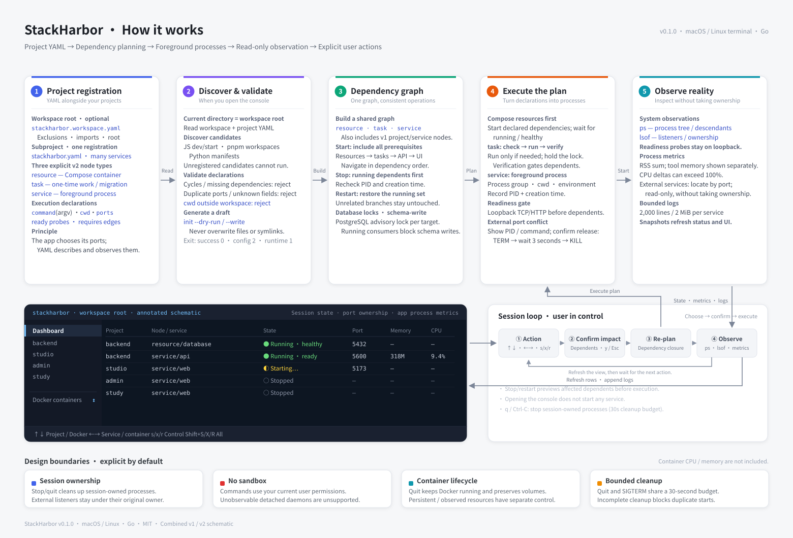

# StackHarbor

**A terminal harbor for your growing fleet of local apps.**

[简体中文](README.zh-CN.md) · [Releases](https://github.com/szhjia/stackharbor/releases) · [Agent skill](skills/stackharbor/SKILL.md) · [Contributing](CONTRIBUTING.md)

[](https://github.com/szhjia/stackharbor/actions/workflows/check.yml)
[](https://github.com/szhjia/stackharbor/releases/latest)
[](LICENSE)
[](https://skills.sh/szhjia/stackharbor)

## Why I built this

AI coding tools are making it easier than ever to build applications. I can turn an idea into a working app quickly—and then move on to the next one. But every new app brings another set of startup commands, ports, background processes, logs, and dependencies. As the number of apps grows, remembering how to run them and what is still running becomes its own job.

I built StackHarbor to reduce that overhead. Open a terminal in a workspace, see its projects in one place, and start, inspect, or stop the services you need. Spend more time building and using your applications, and less time managing terminal tabs.

## Development philosophy

- **Make growing app collections manageable.** A clear overview should answer what is running, where its logs are, and what needs attention.
- **Meet projects where they are.** Register existing foreground commands with readable YAML. Keep each app's language, package manager, and startup contract.
- **Keep actions explicit.** Opening the console starts nothing. Show the impact of stopping or restarting dependencies before executing it.
- **Respect different lifecycles.** A persistent database, a one-time migration, and a web server need different handling. Model resources, tasks, and services separately.
- **Show what is known.** Unknown measurements stay unknown. Distinguish processes owned by this session from services already running elsewhere.
- **Give humans and AI a shared contract.** Versioned configuration, read-only planning, and a bundled agent skill make setup inspectable and repeatable.
- **Stay focused and local.** A single terminal application, with bounded logs and cleanup, should be useful without adding another hosted control plane.

## Interface and how it works



[Open the English diagram](docs/diagrams/how-it-works.en.svg) · [中文图解](docs/diagrams/how-it-works.svg)

The diagram is an annotated schematic, not a live screenshot. The application UI is English; project names and service logs retain their original language. The sidebar selects projects, the dashboard summarizes session state and port ownership, project pages show logs, and `i` reveals command/path details. Select Docker with ↑/↓ and switch containers with ←/→; `d` remains an optional shortcut. Docker container memory/CPU accounting is not included.

## Install on macOS or Linux

Prebuilt releases support Apple Silicon/Intel macOS and arm64/amd64 Linux. Running the binary does not require Go. Download and inspect the installer, then install the latest stable release:

```sh
curl -fsSL https://raw.githubusercontent.com/szhjia/stackharbor/main/scripts/install-release.sh -o /tmp/stackharbor-install.sh
sh /tmp/stackharbor-install.sh
export PATH="$HOME/.local/bin:$PATH"
stackharbor --version
```

The installer selects your platform, verifies the archive against the release's SHA256 manifest, and installs to `~/.local/bin` without sudo. It refuses to overwrite an existing command. Add the PATH line to your shell configuration if needed. To choose a release and destination:

```sh
sh /tmp/stackharbor-install.sh 0.1.0 "$HOME/.local/bin"
```

You can also download an archive and `SHA256SUMS` from [Releases](https://github.com/szhjia/stackharbor/releases), verify it, extract it, and run `sh scripts/install.sh` inside the extracted directory. For upgrades, inspect the existing installation and move the old binary aside before reinstalling; keep it for rollback. Releases are not Apple-notarized.

A real terminal is required. `ps` is used for process trees; install `lsof` for listener ownership (unknown if unavailable). Linux uses `xdg-open` to open URLs. Managed apps still need their own runtime dependencies. Docker is optional, for Compose resources only.

## Build and launch with one command

From a checkout, with Go 1.26+ and Make installed:

```sh
git clone https://github.com/szhjia/stackharbor.git
cd stackharbor
make demo
```

This builds StackHarbor and opens the bundled multi-service example. Press **Shift+S** to start it. Demo ports are 18081–18082; review any conflict before taking action. `q` stops processes started by the session and exits.

| Command | Purpose |
| --- | --- |
| `make build` | Build `dist/stackharbor` |
| `make run ARGS="--root /path/to/workspace"` | Build and open your workspace |
| `make demo` | Build and open the portable demo |
| `make install` | Build and install to `~/.local/bin` |
| `make check` | Formatting, vet, tests, race detector |
| `make release VERSION=0.1.0` | Package all four platform targets |

Without Make: `go build -o dist/stackharbor ./cmd/stackharbor`, then run `./dist/stackharbor --root /path/to/workspace`.

## Register your apps

Run `stackharbor` in a workspace root. It discovers `stackharbor.yaml` files and reads `stackharbor.workspace.yaml` when present. Unregistered manifest candidates are shown for review, never executed automatically.

Place this example in an app directory after confirming that the app uses `pnpm dev` and actually listens on port 3000:

```yaml
version: 2
project: {id: web, name: Web}
context: {cwd: .}
services:
  dev:
    run: {command: [pnpm, dev]}
    ports: [{name: http, port: 3000}]
    ready: {tcp: "127.0.0.1:3000"}
    open: "http://127.0.0.1:3000/"
```

```sh
stackharbor discover --json
stackharbor validate --json
stackharbor plan start --target web/service/dev --json
stackharbor
```

Ports in YAML describe the application; they do not configure its listener. Commands are argv arrays. Paths resolve relative to the registration file and must stay within the selected workspace. Protocol v2 separates resources, tasks, and services and orders them by dependency; v1 remains supported. See the [v2 protocol](docs/protocol-v2.md) (Chinese), [v1 reference](skills/stackharbor/references/registration.md) (English), and [detailed usage](docs/usage.zh-CN.md) (Chinese).

## Use with your AI coding agent

Install the bundled skill through the open skills CLI (requires Node.js/npm):

```sh
npx skills add szhjia/stackharbor --skill stackharbor
```

Then ask your agent:

> Use the stackharbor skill to install StackHarbor on my Mac and register this repository using its existing startup commands.

The skill covers verified GitHub release installation, project discovery, YAML registration, validation, and read-only plans. Installing the skill alone does not install the application. From a permanent checkout or extracted release, `sh scripts/install-skill.sh` can instead link the whole skill into `~/.agents/skills`.

For Docker-backed apps, verify `docker compose version` and `docker info` before startup. The skill checks engine readiness and declared container health separately, and can start the existing Docker Desktop when you request local app startup. StackHarbor itself does not launch Docker Desktop. See [Docker preflight](skills/stackharbor/references/docker.md).

## Keyboard controls

| Keys | Action |
| --- | --- |
| ↑/↓ or j/k; Home | Select project or Docker; return to dashboard |
| ←/→ or h/l | Select service/task, container, or log scope |
| s / x / r | Start / stop / restart selected scope |
| Shift+S / Shift+X / Shift+R | Start all / stop all / restart running set |
| d | Optional shortcut to Docker containers |
| i / o | Toggle details / open service URL |
| PageUp / PageDown / End | Log history or dashboard pages / latest |
| Tab | Switch sidebar/content on narrow terminals |
| ? / Esc | Help / dismiss overlay |
| q / Ctrl-C | Stop session-owned processes and exit |

Stopping or restarting affected dependencies requires confirmation. Persistent resources have separate controls; quitting does not automatically stop Docker containers or delete their data.

## Scope and limits

StackHarbor runs local foreground processes with your user permissions; it is not a sandbox. Normal shutdown targets session-owned processes, with a shared 30-second cleanup budget. External port conflicts require explicit confirmation before release, with process identity checked again before signaling. Unobservable detached daemons are unsupported.

Readiness probes are loopback-only. Logs are bounded (2,000 lines / 2 MiB per service, 16 MiB total) and terminal control sequences are stripped. RSS may double-count shared pages; process CPU can exceed 100%. External service measurements are read-only. Set `NO_COLOR` to disable colors; `STACKHARBOR_CACHE_DIR` overrides the session-lock/history cache directory.

This early release does not provide Windows support, a web console, background supervision, automatic restart, hot reload, or container resource accounting. Configuration validation does not prove an application's real startup or migration behavior.

## Contributing and security

See [CONTRIBUTING.md](CONTRIBUTING.md), [SECURITY.md](SECURITY.md), and [CHANGELOG.md](CHANGELOG.md). CI checks macOS and Linux; version tags publish archives and checksums through GitHub Actions.

Related projects: [Process Compose](https://github.com/F1bonacc1/process-compose) and [Overmind](https://github.com/DarthSim/overmind). StackHarbor focuses on project discovery, self-registration, and a workspace dashboard.

## Star history

[](https://www.star-history.com/#szhjia/stackharbor&Date)

The chart is generated by Star History from public GitHub star data and may take time to reflect new activity.

## License

[MIT](LICENSE). Dependency licenses are included in [THIRD_PARTY_NOTICES](THIRD_PARTY_NOTICES) and `licenses/`.
